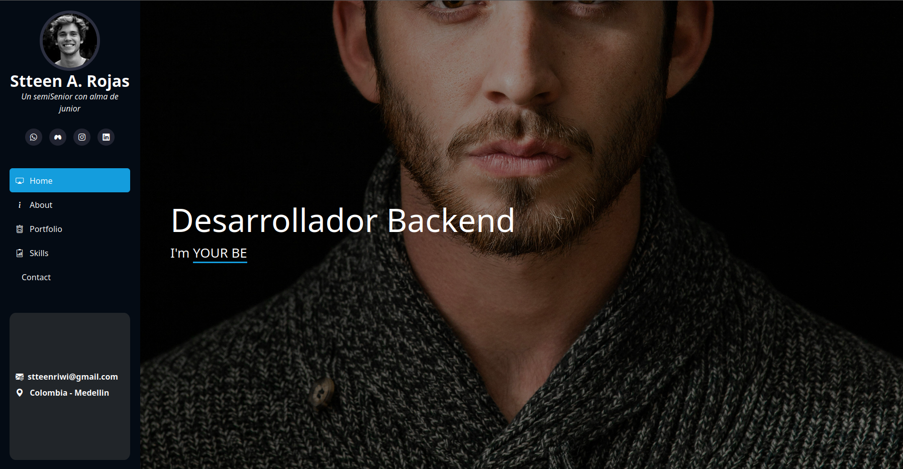

<h1 align="center">
  Stteen A. Rojas S
  
</h1>

  <strong>Backend Developer | C# / .NET | REST APIs | Software Architecture</strong>

  <i>Building clean, scalable, and maintainable applications</i>

---

## <picture></picture> About Me

  

Software Developer focused on backend development with experience in C#, .NET, JavaScript, and PHP.

I apply strong software engineering principles including Object-Oriented Programming (OOP), design patterns, and software architecture to build efficient and maintainable systems.

Experienced working in Agile environments using Scrum, collaborating with teams to deliver scalable solutions.

Currently improving my skills in backend architecture and building high-quality applications.

---

## ⚙️ Tech Stack

<!-- Backend -->

<!-- APIs & Architecture -->

<!-- Frontend -->

<!-- Backend JS -->

<!-- Database & Tools -->

---

## 📌 Featured Project

  

---

## 📫 Contact

  
  

---

## 👾 Contributions

<picture>
  <source media="(prefers-color-scheme: dark)" srcset="https://raw.githubusercontent.com/StteenArts/StteenArts/output/pacman-contribution-graph-dark.svg">
  <source media="(prefers-color-scheme: light)" srcset="https://raw.githubusercontent.com/StteenArts/StteenArts/output/pacman-contribution-graph.svg">
  
</picture>
